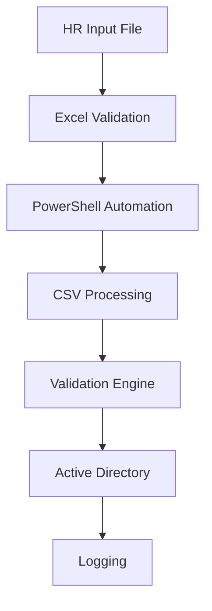

# PowerShell Active Directory User Lifecycle Automation

## Project Overview

This project demonstrates an enterprise-grade Active Directory User Lifecycle Automation framework developed using PowerShell.

The solution automates:

- User Creation
- User Modification
- User Deletion
- Organizational Unit (OU) Mapping
- Automatic OU Movement
- Manager Hierarchy Assignment
- EmployeeID Management
- EmployeeNumber Management
- Group Membership Assignment
- Validation Handling
- Execution Logging
- Scheduled Execution

The automation is designed to reduce manual administrative effort, improve consistency, and standardize Active Directory operations through structured input files.

---

## Business Problem

User onboarding, employee transfers, access provisioning, and offboarding activities are often repetitive and manually executed tasks.

Manual processes can result in:

- Provisioning delays
- Incorrect OU placement
- Access assignment errors
- Human input mistakes
- Increased administrative effort

This framework automates the complete lifecycle process using PowerShell and Active Directory automation.

---

## Key Features

### User Lifecycle Management

- Create Active Directory users
- Modify existing users
- Delete users

### Organizational Management

- Country-based OU mapping
- Department-based OU mapping
- Automatic OU movement during transfers

### Identity Management

- EmployeeID support
- EmployeeNumber support
- Manager hierarchy assignment

### Access Management

- Reference user group cloning
- Reference EmployeeID lookup
- Reference EmployeeNumber lookup

### Governance

- Validation handling
- Execution logging
- Scheduler integration

---

## Technology Stack

- PowerShell
- Active Directory
- Windows Server
- ImportExcel Module
- Task Scheduler
- CSV Processing
- Excel Automation

---

## Architecture



---

## Project Structure

```text
powershell-ad-user-automation
│
├── docs
├── diagrams
├── scripts
├── templates
├── logs
└── screenshots
```

---

## Skills Demonstrated

- PowerShell Scripting
- Active Directory Administration
- Infrastructure Automation
- Identity & Access Management
- Process Optimization
- Error Handling
- Logging Frameworks
- Windows Server Administration
- Enterprise Documentation

---

## Future Enhancements

- REST API Integration
- Azure AD Integration
- ServiceNow Integration
- Approval Workflows
- Email Notifications
- Reporting Dashboard

---

## Author

Yash Umadi
