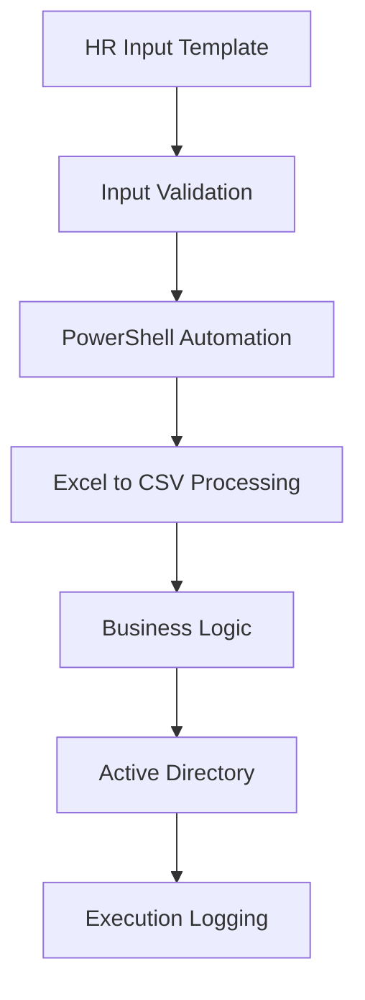

# PowerShell Active Directory User Lifecycle Automation

## Project Overview

This project demonstrates an enterprise-grade Active Directory User Lifecycle Automation framework developed using PowerShell.

The solution automates the complete user lifecycle process including onboarding, modifications, organizational transfers, access provisioning, and offboarding while reducing manual administrative effort and improving operational consistency.

---

## Business Problem

Managing Active Directory users manually can be time-consuming and error-prone.

Common challenges include:

- User provisioning delays
- Incorrect OU placement
- Inconsistent access assignments
- Manual group membership management
- Human input errors
- Lack of centralized logging

This automation framework addresses these challenges through a structured PowerShell-based solution.

---

## Key Features

### User Lifecycle Management

- Create Active Directory Users
- Modify Existing Users
- Delete Users
- Enable / Disable Accounts

### Organizational Management

- Country-Based OU Mapping
- Department-Based OU Mapping
- Automatic OU Movement
- Manager Hierarchy Assignment

### Identity Management

- EmployeeID Support
- EmployeeNumber Support
- Reference Employee Lookup
- User Attribute Management

### Access Management

- Group Membership Cloning
- Reference User Support
- Role-Based Access Provisioning

### Governance & Operations

- Input Validation
- Error Handling
- Execution Logging
- Scheduled Execution
- Excel-to-CSV Processing

---

## Technology Stack

| Technology | Purpose |
|------------|----------|
| PowerShell | Automation Framework |
| Active Directory | Identity Management |
| ImportExcel Module | Excel Processing |
| Windows Server | Execution Environment |
| Task Scheduler | Automated Execution |
| CSV Processing | Data Validation Layer |

---

## Solution Architecture



---

## Project Structure

```text
powershell-ad-user-automation
│
├── README.md
│
├── docs
│   ├── Project_Overview.md
│   └── Skills_Demonstrated.md
│
├── diagrams
│   └── Architecture.md
│
├── scripts
│   └── ad_user_lifecycle_automation.ps1
│
├── templates
│   └── sample_users.csv
│
├── screenshots
│   ├── excel-template.png
│   ├── workflow-diagram.png
│   └── sample-log-output.png
│
└── logs
```

---

## Workflow

1. HR team prepares user data.
2. Data is validated using predefined templates.
3. PowerShell automation processes the input.
4. Business rules determine user actions.
5. Active Directory operations are executed.
6. Logs are generated for auditing and troubleshooting.

---

## Sample Screenshots

### Input Template


### Workflow Diagram


### Execution Logs


---

## Skills Demonstrated

### Infrastructure Automation

- Process Automation
- Scheduled Execution
- Task Automation
- Operational Standardization

### Active Directory Administration

- User Lifecycle Management
- OU Management
- Group Management
- Identity Administration

### PowerShell Development

- Automation Scripting
- Data Processing
- Error Handling
- Logging Frameworks

### Identity & Access Management

- Employee Identity Management
- Manager Hierarchy Assignment
- Access Provisioning
- Role-Based Access Control

### Documentation

- Technical Documentation
- Architecture Design
- Operational Procedures
- Implementation Guides

---

## Benefits

- Reduced Manual Effort
- Faster User Provisioning
- Standardized Operations
- Improved Accuracy
- Better Auditability
- Reduced Human Error
- Improved Scalability

---

## Future Enhancements

- REST API Integration
- Azure AD Integration
- ServiceNow Integration
- Approval Workflows
- Email Notifications
- Self-Service Portal
- Reporting Dashboard

---

## Author

**Yash Umadi**

Infrastructure Monitoring | PowerShell Automation | Active Directory | Windows Server | Linux Administration | Azure Administration

---

## Disclaimer

This repository contains a sanitized demonstration version of an enterprise automation framework. All customer-specific information, domains, organizational structures, credentials, and internal configurations have been removed or replaced with generic examples.
